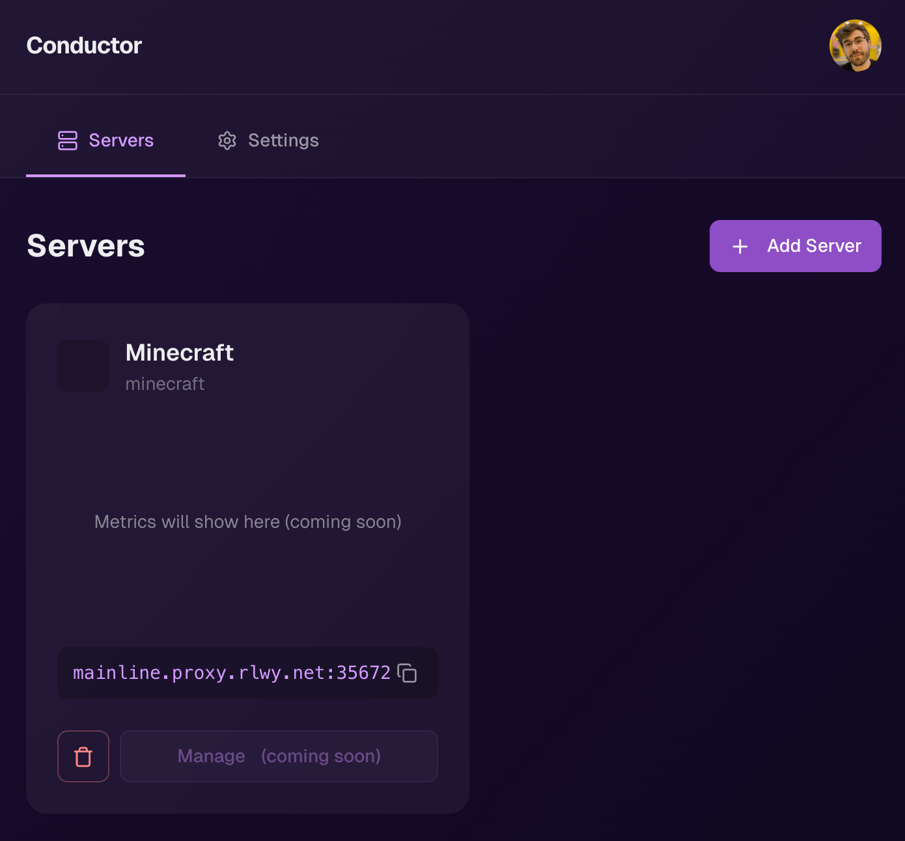

# 🚂 Conductor

Conductor is a **very early-stage** deployment orchestration platform for Railway that simplifies game server management through an intuitive interface.

## Features
- Easy deployment orchestration
- User-friendly server management
- Built for Railway infrastructure
- Streamlined game server operations

